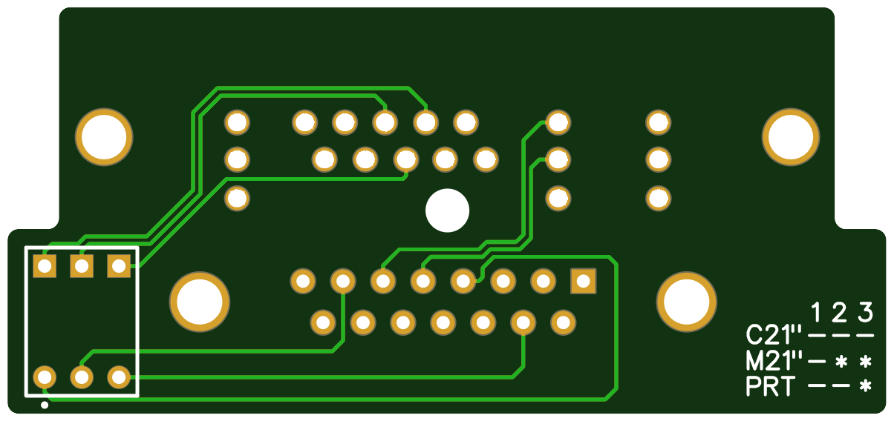
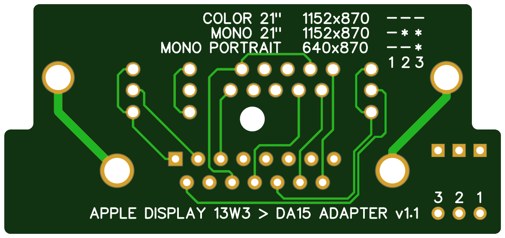

# Apple 13W3 to DA15 Display Adapter

This project aims to provide a relatively inexpensive method for allowing one to connect 13W3-based Apple monitors to Macs with DA15 display connectors. 

This adapter supports three displays. While that may seem like a very limited range of monitrors to require a purpose-built adapter, this adapter (even with its $15-20 13W3 connector) is still a fraction of the cost of an original cable used to drive these displays. If the premise of (of all things) a fairly basic OEM video cable costing $100+ seems laughable, you are probably not a [GameCube collector](https://www.ebay.com/b/Nintendo-GameCube-Video-Game-Component-YPbPr-Cables-Adapters/171814/bn_3144365?rt=nc&_sop=16), lol. The following displays supported by this adapter are:

- Macintosh 21" Color Display
- Two-Page Monochrome Display
- Macintosh Portrait Display

The BOM for the adapter is as follows:

- 1 - 13W3 Right Angle Connector - NorComp, Part No. 685M13W3103L461 ([Mouser](https://www.mouser.com/ProductDetail/636-685M13W3103L461))
- 1 - DA15 Right Angle Connector - Amphenol FCI, Part No. ID15S33E4GV00LF ([Mouser](https://www.mouser.com/ProductDetail/649-ID15S33E4GV00LF))
- 1 - DIP Switch, 3 Position - Wurth Elektronik, Part No. 418117270903 ([Mouser](https://www.mouser.com/ProductDetail/710-418117270903))

## Function

Prior to connecting the adapter, use the DIP switch to set the sense code for the monitor to be connected to.

- Macintosh 21" Color Display	1:OFF	2:OFF	3:OFF
- Two-Page Monochrome Display	1:OFF	2:ON	3:ON
- Macintosh Portrait Display	1:OFF	2:OFF	3:ON

Once the sense code is set, connect the adapter and proceed with starting up the monitor and Macintosh.

## Attributions

Included in this repo is a copy of [a very helpful reference document](https://github.com/sfiera/mactech) by Chris Pickel (GitHub: sfiera) that details sense settings for Apple displays; this document was indispensable in developing this adapter and it is included here for comprehensiveness. Many thanks to Chris for documenting these settings! This document can be found in the display_info subdirectory under "docs".